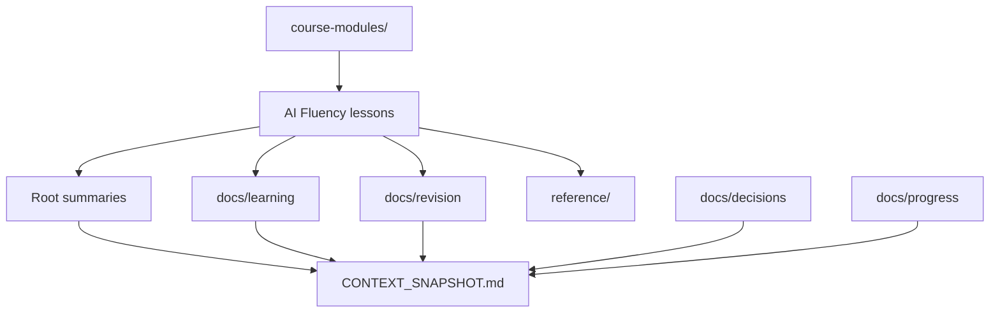
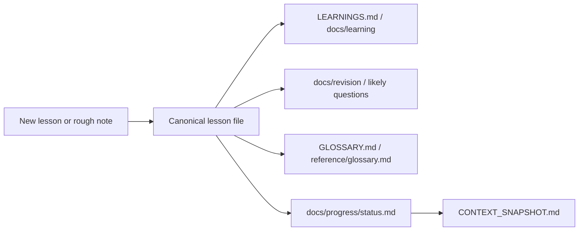

# Architecture

This is a Markdown knowledge workspace, not an executable software application. Its architecture is the organization of learning content, revision surfaces, and project memory.

## Repository Map

## Content Layers

- `course-modules/` is the canonical lesson layer.
- `reference/` stores broad exam aids that can be reused across modules.
- Root files are quick-entry dashboards for orientation, revision, decisions, and continuity.
- `docs/` stores deeper semantic organization by purpose.

## Current Module

`course-modules/ai-fluency/` contains one complete course module with 11 lessons:

1. AI Fluency introduction
2. Meaning of AI Fluency
3. 4D Framework
4. Generative AI fundamentals
5. LLM capabilities and limitations
6. Delegation
7. Description
8. Prompting techniques
9. Discernment
10. Diligence
11. Course synthesis

## Knowledge Flow

## Dependencies

There are no runtime dependencies. The workspace depends on disciplined Markdown maintenance:

- Keep concepts organized by topic, not by chat history.
- Keep one canonical explanation per concept.
- Update snapshot and progress files whenever durable project state changes.
