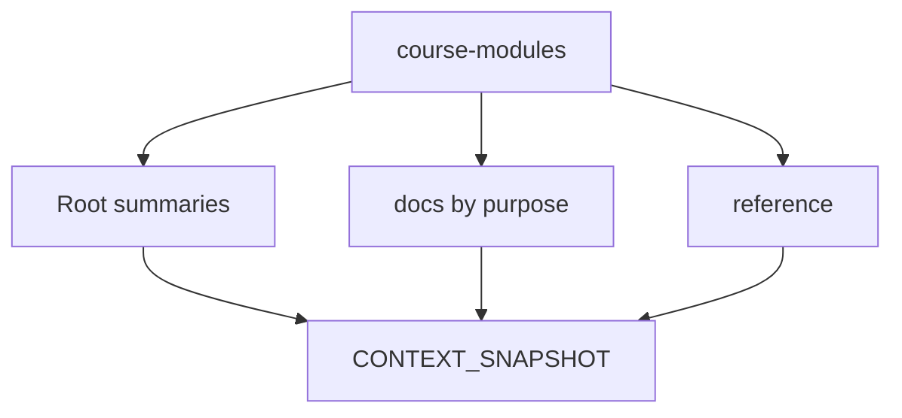

# Architecture Overview

The workspace is organized as a learning knowledge system.

## Layers

- Source layer: `course-modules/`
- Reference layer: `reference/`
- Orientation layer: root files
- Semantic layer: `docs/`
- Memory layer: `CONTEXT_SNAPSHOT.md`

## Diagram

## Rule

When content changes, update the nearest canonical source first, then update only the summaries affected by that change.
