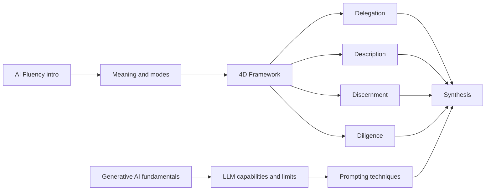

# Course Map

## Current Feature Set

This repository currently supports one learning feature: AI Fluency foundation preparation for Claude Solution Architect study.

## Lesson Relationships

## Dependencies

- Lessons 1-3 define the mental model.
- Lessons 4-5 explain the technology base and limitations.
- Lessons 6-10 deepen each practical competency.
- Lesson 11 integrates the course.
